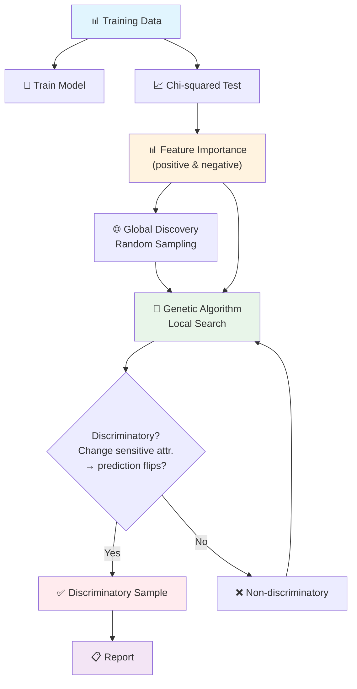

# ChiGA: Chi-squared Guided Genetic Algorithm for Fairness Testing

[](https://www.python.org/downloads/)
[](LICENSE)

**One Size Fits All: Ranking Discriminatory Attributes for Fairness Testing without Local Interpreters**

ChiGA is a lightweight fairness testing framework that discovers discriminatory inputs in machine learning models **without relying on local explanation methods (e.g., LIME, SHAP)**. Instead, it uses **Chi-squared (χ²) feature selection** to rank features by their importance to model decisions, then guides a **Genetic Algorithm (GA)** to efficiently search for individual discriminatory instances.

## Overview

Modern ML fairness testing tools typically depend on local interpretability methods (LIME, SHAP) to identify which features influence model predictions, then perturb those features to find discriminatory behaviours. However, local explainers are computationally expensive and their fidelity varies across models and data distributions.

**ChiGA** replaces local explainers with a simple yet effective statistical test — the **Chi-squared test for feature importance** — to rank discriminatory attributes. The key insight: features that are strongly associated with the model's output are also likely candidates for discrimination. ChiGA uses this ranking to guide a Genetic Algorithm toward regions of the input space where discriminatory samples are more likely to exist.

### Workflow



### Key Features

- **No local explainer needed** — uses χ² statistical test instead of LIME/SHAP
- **Efficient** — χ² is O(n) on the dataset, vs. O(n×k) for LIME explanations
- **Generalizable** — works across any ML model type (NN, tree, SVM) without model-specific tooling
- **Multi-dataset** — supports Census Income, German Credit, Bank Marketing, and COMPAS

## Project Structure

```
.
├── ChiGA/                          # Main approach: Chi-squared + GA
│   ├── ChiGA.py                    # Entry point for ChiGA fairness testing
│   └── Genetic_Algorithm.py        # GA with χ²-guided mutation
├── ExpGA/                          # Baseline: LIME Explainer + GA
│   ├── ExpGA.py                    # Entry point for ExpGA baseline
│   └── Genetic_Algorithm.py        # Standard GA (no importance guidance)
├── data/                           # Dataset loaders
│   ├── census.py                   # Census Income (13 features)
│   ├── credit.py                   # German Credit (20 features)
│   ├── bank.py                     # Bank Marketing (16 features)
│   ├── bank_process.py             # Bank raw data preprocessor
│   └── compas.py                   # COMPAS recidivism (14 features)
├── datasets/                       # Raw and processed data files
│   ├── bank_raw/                   # Bank Marketing raw CSV
│   └── compas_raw/                 # COMPAS raw CSV
├── utils/                          # Configuration and utilities
│   ├── config.py                   # Per-dataset feature specs & bounds
│   └── utils.py                    # Helper functions
├── unfair_models/                  # Pre-trained biased models (.pkl)
│   ├── census/                     # MLP, RF, SVC, DNN for Census
│   ├── credit/                     # MLP, RF, SVC, DNN for Credit
│   ├── bank/                       # MLP, RF, SVC, DNN for Bank
│   └── compas/                     # MLP, RF, SVC, DNN for COMPAS
├── retrained_models/               # Fairness-aware retrained models (.pkl)
│   ├── census/{1,8,9}/
│   ├── credit/{9,13}/
│   ├── bank/{1}/
│   └── compas/{1,2,3}/
├── requirements.txt                # Python dependencies
└── README.md
```

## Supported Datasets

| Dataset | Features | Samples | Sensitive Attributes | Classes |
|---------|----------|---------|---------------------|---------|
| Census Income | 13 | 48,842 | sex (9), age (1), race (8) | ≤50K / >50K |
| German Credit | 20 | 1,000 | sex (9), age (13) | Good / Bad |
| Bank Marketing | 16 | 45,211 | age (1) | Yes / No |
| COMPAS | 14 | 7,214 | sex (1), age (2), race (3) | Low / High |

## Installation

```bash
# Clone the repository
git clone git@github.com:Zhao2z/ChiGA.git
cd ChiGA

# Install dependencies
pip install -r requirements.txt
```

**Requirements:** Python 3.8+, numpy, scikit-learn, lime, joblib.

## Usage

### Running ChiGA (Chi-squared + Genetic Algorithm)

1. Edit `ChiGA/ChiGA.py` to configure:
   - `dataset`: one of `"census"`, `"credit"`, `"bank"`, `"compas"`
   - `sensitive_param`: the sensitive attribute index (see table above)
   - `classifier_name`: path to the model `.pkl` file

2. Run:
```bash
cd ChiGA
python ChiGA.py
```

The script performs:
1. **Global Discovery** — randomly samples the input space
2. **Local Search** — runs the Genetic Algorithm for up to 1 hour, guided by χ² feature importance

Results are saved to a `.npy` file with the discovered discriminatory inputs.

### Running ExpGA (LIME + GA Baseline)

```bash
cd ExpGA
python ExpGA.py
```

Similar configuration is needed within the script.

## How It Works

### Phase 1: Feature Importance via Chi-squared Test

The χ² test evaluates whether each feature is independent of the model's predictions. Features with high χ² scores (strong dependence on the output) receive higher mutation probability during the GA phase. Features with low scores (weak dependence) are preferentially mutated in *non-discriminatory* samples to help the GA escape local optima.

### Phase 2: Global Discovery

Random samples are drawn uniformly from the input space, with the sensitive attribute fixed to its lowest value. This creates the initial population pool.

### Phase 3: Genetic Algorithm Local Search

The GA evolves the population through three operations:

1. **Selection** — fitness-proportional selection; samples with larger prediction differences when the sensitive attribute changes are more likely to survive
2. **Mutation** — guided by χ² importance: for discriminatory samples, high-importance features are mutated (to refine the search); for non-discriminatory samples, low-importance features are mutated (to explore new regions)
3. **Crossover** — swaps feature segments between pairs of samples

### Discrimination Criterion

A sample is **discriminatory** if varying the sensitive attribute (e.g., sex = male → female) while keeping all other features fixed causes the model's prediction to change. The fitness score is the maximum prediction probability difference across all sensitive attribute values.

## Baseline Comparison

**ExpGA** (Explainer-guided GA) uses LIME explanations in place of χ² feature ranking:
- LIME fits a local surrogate model for each sample to estimate feature importance
- Computationally heavier: each explanation requires k model queries
- Fidelity depends on the kernel width and local linearity assumption

ChiGA replaces this with a single global χ² test, making it both faster and more robust across model types.

## Citation

If you use ChiGA in your research, please cite:

```bibtex
@inproceedings{chiga2026,
  title     = {One Size Fits All: Ranking Discriminatory Attributes for Fairness Testing without Local Interpreters},
  author    = {Zhao, ...},
  booktitle = {QSR 2026},
  year      = {2026}
}
```

## License

This project is licensed under the MIT License.
